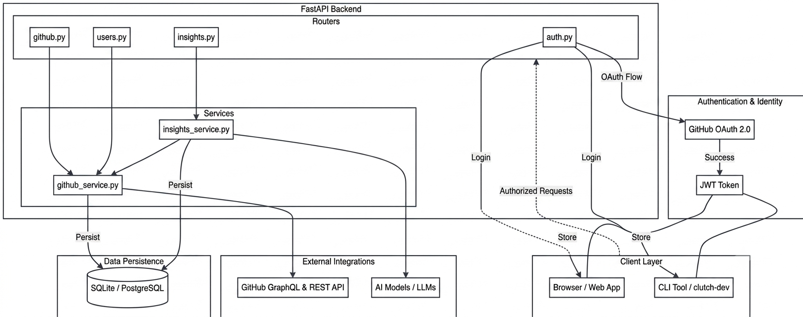

# Clutch — Developer Activity Dashboard

> GitHub tracks your work. Clutch tracks you.

Clutch is an open-source developer dashboard that integrates directly with your GitHub to provide deep insights into your coding journey. It visualizes commit streaks, activity patterns, and language breakdowns, all enhanced by AI-powered weekly summaries. Clutch also ships with a dedicated CLI tool, allowing you to access your developer stats without ever leaving your terminal.

Live at [clutch-laypatel.netlify.app](https://clutch-laypatel.netlify.app)

---

## What it does

- **Commit Tracking**: Monitor your commit streaks and identify your longest active coding periods.
- **Activity Visualization**: View a detailed activity chart for the last 30 days, powered by the GitHub GraphQL API.
- **Productivity Detection**: Automatically detect your most productive days and identify your top-performing repositories.
- **AI-Powered Summaries**: Generate weekly coding activity summaries using AI models (Groq/Llama 3.1).
- **Public Profiles**: Showcase your developer identity with a customizable public profile at `/u/your-username`.
- **Terminal Access**: A powerful CLI tool (`clutch-dev`) for instant, authenticated access to your stats.

---

## Architecture

Clutch utilizes a decoupled architecture where both the web frontend and CLI interact with a unified FastAPI backend.



### Tech Stack

| Layer | Technology |
|-------|------------|
| **Backend** | FastAPI, SQLAlchemy, SQLite (Development) / PostgreSQL (Production) |
| **Frontend** | React, TypeScript, Tailwind CSS, Recharts |
| **Typography** | Arbutus (Headings), Space Grotesk (UI), JetBrains Mono (Technical) |
| **Auth** | GitHub OAuth 2.0 + JWT |
| **AI** | AI Models (Groq Llama-3.1-8b-instant / Extensible) |
| **Data** | GitHub GraphQL & REST APIs |
| **CLI** | Typer, Rich, HTTPX |
| **Deploy** | Render (Backend), Netlify (Frontend) |

---

## Project Structure

```text
clutch/
│
├── backend/                        # FastAPI backend service
│   ├── app/
│   │   ├── main.py                 # App entry point, registers all routers
│   │   ├── settings.py             # Environment variables and configuration
│   │   ├── database.py             # SQLAlchemy database connection and session
│   │   ├── dependencies.py         # JWT authentication middleware
│   │   │
│   │   ├── models/                 # Database Schemas
│   │   │   ├── user.py             # User model — stores GitHub profile and tokens
│   │   │   ├── activity.py         # DailyActivity model — stores synced GitHub stats
│   │   │   └── insight.py          # WeeklyInsight model — stores AI generated insights
│   │   │
│   │   ├── routers/                # API Endpoints
│   │   │   ├── auth.py             # GitHub OAuth flow and JWT creation
│   │   │   ├── github.py           # Activity, streak, language and sync endpoints
│   │   │   ├── users.py            # User profile endpoints
│   │   │   └── insights.py         # AI insight and pattern detection endpoints
│   │   │
│   │   └── services/               # Core Logic
│   │       ├── github_service.py   # GitHub GraphQL API calls and data processing
│   │       └── insights_service.py # AI integration and pattern detection
│   │
│   ├── requirements.txt
│   └── .env.example
│
├── frontend/                       # React + TypeScript frontend
│   ├── src/
│   │   ├── main.tsx                # React entry point
│   │   ├── App.tsx                 # Router setup and protected routes
│   │   ├── index.css               # Global styles and design tokens
│   │   │
│   │   ├── context/
│   │   │   └── AuthContext.tsx     # Auth state management and JWT handling
│   │   │
│   │   ├── utils/
│   │   │   └── api.ts              # Axios instance with auth interceptors
│   │   │
│   │   └── pages/                  # Application Views
│   │       ├── Landing.tsx         # Landing page with sign in
│   │       ├── Dashboard.tsx       # Main dashboard with stats and charts
│   │       ├── Profile.tsx         # Public user profile page
│   │       └── AuthCallback.tsx    # Handles GitHub OAuth redirect and token storage
│   │
│   ├── public/
│   │   └── _redirects              # Netlify SPA routing config
│   ├── package.json
│   └── .env.example
│
└── cli/                            # Typer CLI tool
    ├── clutch_cli/
    │   ├── main.py                 # CLI entry point, registers all commands
    │   ├── config.py               # Token storage in ~/.clutch/config.json
    │   ├── api.py                  # Authenticated HTTP client
    │   ├── auth.py                 # login, logout, whoami commands
    │   ├── streak.py               # clutch streak command
    │   ├── stats.py                # clutch stats command
    │   ├── insight.py              # clutch insight command
    │   ├── repos.py                # clutch repos command
    │   └── patterns.py             # clutch patterns command
    └── setup.py
```

---

## Running Locally

### Prerequisites

- Python 3.11 or higher
- Node.js 20 or higher
- A GitHub OAuth app
- A Groq API key

### 1. Create a GitHub OAuth App

Navigate to [GitHub Developer Settings](https://github.com/settings/developers) and create a new OAuth app:

- **Homepage URL**: `http://localhost:5173`
- **Authorization callback**: `http://localhost:8000/auth/github/callback`

Copy the **Client ID** and **Client Secret**.

### 2. Backend Setup

```bash
cd backend
python -m venv venv
source venv/bin/activate        # Windows: venv\Scripts\activate
pip install -r requirements.txt
cp .env.example .env
```

**Configure `.env`**:
```text
DATABASE_URL=sqlite:///./clutch.db

SECRET_KEY=your-secret-key

ALGORITHM=HS256

ACCESS_TOKEN_EXPIRE_MINUTES=10080

GITHUB_CLIENT_ID=your_client_id

GITHUB_CLIENT_SECRET=your_client_secret

GITHUB_REDIRECT_URI=http://localhost:8000/auth/github/callback

GROQ_API_KEY=your_groq_key

FRONTEND_URL=http://localhost:5173

ENVIRONMENT=development
```

**Start the Backend**:
```bash
uvicorn app.main:app --reload
```
The backend will run at `http://localhost:8000`. Documentation is available at `http://localhost:8000/docs`.

### 3. Frontend Setup

```bash
cd frontend
npm install
cp .env.example .env
```

**Configure `.env`**:
```text
VITE_API_URL=http://localhost:8000
```

**Start the Frontend**:
```bash
npm run dev
```
The frontend will run at `http://localhost:5173`.

### 4. CLI Setup

> **Note**: The CLI is currently in development and must be installed locally from source.

```bash
cd cli
pip install -e .
export CLUTCH_API_URL=http://localhost:8000
```

**Authentication Flow**:
Run the following command to begin:
```bash
clutch auth login
```
You will be prompted for a JWT token. To retrieve your token:
1.  Navigate to your live dashboard after logging in via the web.
2.  The JWT token is present in the URL: `https://clutch-laypatel.netlify.app/auth/callback?token=...`
3.  Alternatively, open the browser console (`Cmd+Opt+J` on Mac or `Ctrl+Shift+J` on Windows) while on the callback page to find the token.

Paste the token back into your terminal to complete the login.

---

## API Endpoints

| Method | Endpoint | Description |
|--------|----------|-------------|
| `GET` | `/auth/github` | Start GitHub OAuth flow |
| `GET` | `/auth/github/callback` | Handle OAuth callback |
| `GET` | `/users/me` | Get authenticated user profile |
| `GET` | `/users/{username}` | Get public user profile |
| `GET` | `/github/activity` | Fetch activity for last N days |
| `GET` | `/github/streak` | Calculate current and longest streaks |
| `GET` | `/github/languages` | Retrieve language breakdown |
| `POST` | `/github/sync` | Sync activity data to database |
| `GET` | `/insights/weekly` | Generate AI weekly insights |
| `GET` | `/insights/patterns` | Detect coding patterns |

---

## Contributing

Contributions are highly encouraged! Please review [CONTRIBUTING.md](./CONTRIBUTING.md) for setup instructions and our commit conventions. Look for issues labeled `good first issue` to start.

---

## License

This project is licensed under the **MIT License** — free to use, modify, and distribute.