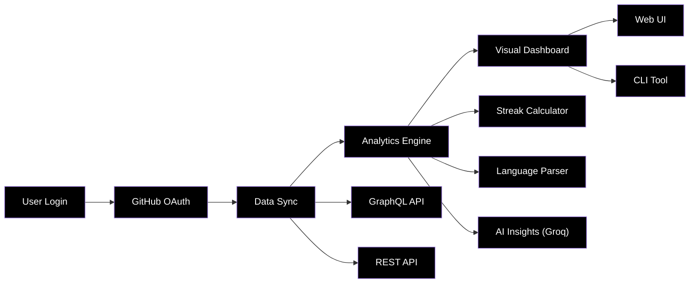

<div align="center">

# ⚙️ Clutch

### *AI-Powered Developer Activity & Productivity Dashboard*

[](https://github.com/laypatel/clutch)
[](https://clutch-woad.vercel.app)

<br/>

[](https://react.dev)
[](https://fastapi.tiangolo.com)
[](https://python.org)
[](https://typescriptlang.org)
[](https://tailwindcss.com)
[](https://groq.com)

<br/>

**Clutch** — *the ultimate developer companion* — is an open-source dashboard that connects directly to your GitHub to visualize your coding journey. It tracks commit streaks, identifies activity patterns, and provides AI-powered weekly insights to help you understand your productivity better than ever before.

<br/>

[🌐 Live Demo](https://clutch-woad.vercel.app) · [📖 API Docs](https://clutch-api.onrender.com) · [💻 CLI Tool](#-cli-setup) · [🐛 Report Bug](https://github.com/laypatel/clutch/issues) · [✨ Request Feature](https://github.com/laypatel/clutch/issues)

</div>

---

## 📋 Table of Contents

- [🎯 The Mission](#-the-mission)
- [✨ Key Features](#-key-features)
- [🔬 How It Works](#-how-it-works)
- [🏗️ System Architecture](#️-system-architecture)
- [🛠️ Tech Stack](#️-tech-stack)
- [🚀 Quick Start](#-quick-start)
- [📊 API Reference](#-api-reference)
- [🗂️ Project Structure](#️-project-structure)
- [🤝 Contributing](#-contributing)
- [📜 License](#-license)

---

## 🎯 The Mission

<table>
<tr>
<td width="60%">

### GitHub tracks your work. Clutch tracks you.

-  **Visualize** your contribution streaks and longest active periods.
-  **Understand** your coding patterns with AI-powered weekly summaries.
-  **Identify** your most productive days and top-performing repositories.
-  **Access** your stats instantly via the terminal with a dedicated CLI.
-  **Showcase** your developer identity with a professional public profile.

> *"Clutch isn't just a dashboard; it's a mirror for your developer journey, helping you stay consistent and focused."*

</td>
</tr>
</table>

---

## ✨ Key Features

<table>
<tr>
<td align="center" width="33%">
<h3>📊 Activity Charts</h3>
<p>Beautiful, high-fidelity visualizations of your GitHub contributions over the last 30 days using the GraphQL API.</p>
</td>
<td align="center" width="33%">
<h3>🧠 AI Summaries</h3>
<p>Weekly insights generated by Llama 3.1 (via Groq) that analyze your commits to provide actionable feedback.</p>
</td>
<td align="center" width="33%">
<h3>⚡ CLI First</h3>
<p>A powerful terminal companion (<code>clutch-cli</code>) for instant access to streaks, stats, and insights.</p>
</td>
</tr>
<tr>
<td align="center" width="33%">
<h3>🔥 Streak Tracking</h3>
<p>Keep the fire alive with precise tracking of your current and all-time longest commit streaks.</p>
</td>
<td align="center" width="33%">
<h3>🌍 Public Profiles</h3>
<p>A dedicated, minimalist profile page at <code>/u/username</code> to share your achievements with the world.</p>
</td>
<td align="center" width="33%">
<h3>🔐 Secure Auth</h3>
<p>Seamless GitHub OAuth 2.0 integration with JWT-based session management for the web and CLI.</p>
</td>
</tr>
</table>

---

## 🔬 How It Works



---

## 🏗️ System Architecture

Clutch uses a modern, decoupled architecture designed for speed and reliability.


---

## 🛠️ Tech Stack

### Frontend
| Technology | Purpose |
|:---|:---|
|  | UI Framework with modern hooks |
|  | Lightning-fast build tool |
|  | Utility-first styling |
|  | Data visualization |

### Backend
| Technology | Purpose |
|:---|:---|
|  | Runtime environment |
|  | High-performance API framework |
|  | SQL Toolkit and ORM |
|  | Local data persistence |

### External Services
| Technology | Purpose |
|:---|:---|
|  | Data source (GraphQL & REST) |
|  | AI insight generation |
|  | Secure session management |

---

## 🚀 Quick Start

### Prerequisites

- Python 3.11 or higher
- Node.js 20 or higher
- A GitHub OAuth app
- A Groq API key

### 1️⃣ Create a GitHub OAuth App

Navigate to [GitHub Developer Settings](https://github.com/settings/developers) and create a new OAuth app:

- **Homepage URL**: `http://localhost:5173`
- **Authorization callback**: `http://localhost:8000/auth/github/callback`

Copy the **Client ID** and **Client Secret**.

### 2️⃣ Backend Setup

```bash
cd backend
```
```bash
python -m venv venv
```
```bash
source venv/bin/activate        # Windows: venv\Scripts\activate
```
```bash
pip install -r requirements.txt
```
```bash
cp .env.example .env
```

**Configure `.env`**:
```text
DATABASE_URL = sqlite:///./clutch.db

SECRET_KEY = your-secret-key

ALGORITHM = HS256

ACCESS_TOKEN_EXPIRE_MINUTES = 10080

GITHUB_CLIENT_ID = your_client_id

GITHUB_CLIENT_SECRET = your_client_secret

GITHUB_REDIRECT_URI = http://localhost:8000/auth/github/callback

GROQ_API_KEY = your_groq_key

FRONTEND_URL = http://localhost:5173

ENVIRONMENT = development
```

**Start the Backend**:
```bash
uvicorn app.main:app --reload
```
The backend will run at `http://localhost:8000`. Documentation is available at `http://localhost:8000/docs`.

### 3️⃣ Frontend Setup

```bash
cd frontend
```
```bash
npm install
```
```bash
cp .env.example .env
```

**Configure `.env`**:
```text
VITE_API_URL=http://localhost:8000
```

**Start the Frontend**:
```bash
npm run dev
```
The frontend will run at `http://localhost:5173`.

### 4️⃣ CLI Setup

```bash
pip install clutch-cli
```

Or install locally from source:

```bash
cd cli
pip install -e .
```

**Login** (fully automatic — no token copy-pasting):

```bash
clutch login
```

Your browser opens, you authorize on GitHub, and the terminal automatically captures the token. Done.

To point the CLI at a local backend instead of the hosted API:

```bash
export CLUTCH_API_URL=http://localhost:8000
clutch login
```

**Available Commands**:

| Command | Description |
|---|---|
| `clutch login` | Login via GitHub OAuth (automatic) |
| `clutch logout` | Logout and clear credentials |
| `clutch whoami` | Show logged-in user |
| `clutch streak` | Current and longest commit streak |
| `clutch stats [--days N]` | Activity stats for last N days |
| `clutch repos` | Most recently active repositories |
| `clutch insight` | AI-generated weekly insight |
| `clutch patterns` | Coding patterns and habits |
| `clutch status` | Login status and API health |
| `clutch --version` | Show CLI version |

---

## 📊 API Reference

| Method | Endpoint | Description |
|--------|----------|-------------|
| `GET` | `/auth/github` | Start GitHub OAuth flow |
| `GET` | `/auth/github/callback` | Handle OAuth callback |
| `GET` | `/users/me` | Get authenticated user profile |
| `GET` | `/users/{username}` | Get public user profile |
| `GET` | `/github/activity` | Fetch activity for last N days |
| `GET` | `/github/streak` | Calculate current and longest streaks |
| `GET` | `/github/languages` | Retrieve language breakdown |
| `POST` | `/github/sync` | Sync activity data to database |
| `GET` | `/insights/weekly` | Generate AI weekly insights |
| `GET` | `/insights/patterns` | Detect coding patterns |

---

## 🗂️ Project Structure

```text
clutch/
│
├── backend/                        # FastAPI backend service
│   ├── app/
│   │   ├── main.py                 # App entry point, registers all routers
│   │   ├── settings.py             # Environment variables and configuration
│   │   ├── database.py             # SQLAlchemy database connection and session
│   │   ├── dependencies.py         # JWT authentication middleware
│   │   │
│   │   ├── models/                 # Database Schemas
│   │   │   ├── user.py             # User model — stores GitHub profile and tokens
│   │   │   ├── activity.py         # DailyActivity model — stores synced GitHub stats
│   │   │   └── insight.py          # WeeklyInsight model — stores AI generated insights
│   │   │
│   │   ├── routers/                # API Endpoints
│   │   │   ├── auth.py             # GitHub OAuth flow and JWT creation
│   │   │   ├── github.py           # Activity, streak, language and sync endpoints
│   │   │   ├── users.py            # User profile endpoints
│   │   │   └── insights.py         # AI insight and pattern detection endpoints
│   │   │
│   │   └── services/               # Core Logic
│   │       ├── github_service.py   # GitHub GraphQL API calls and data processing
│   │       └── insights_service.py # AI integration and pattern detection
│   │
│   ├── requirements.txt
│   └── .env.example
│
├── frontend/                       # React + TypeScript frontend
│   ├── src/
│   │   ├── main.tsx                # React entry point
│   │   ├── App.tsx                 # Router setup and protected routes
│   │   ├── index.css               # Global styles and design tokens
│   │   │
│   │   ├── context/
│   │   │   └── AuthContext.tsx     # Auth state management and JWT handling
│   │   │
│   │   ├── utils/
│   │   │   └── api.ts              # Axios instance with auth interceptors
│   │   │
│   │   └── pages/                  # Application Views
│   │       ├── Landing.tsx         # Landing page with sign in
│   │       ├── Dashboard.tsx       # Main dashboard with stats and charts
│   │       ├── Profile.tsx         # Public user profile page
│   │       └── AuthCallback.tsx    # Handles GitHub OAuth redirect and token storage
│   │
│   ├── public/
│   │   └── _redirects              # SPA routing config
│   ├── package.json
│   └── .env.example
│
└── cli/                            # Typer CLI tool (published as clutch-cli on PyPI)
    ├── clutch_cli/
    │   ├── main.py                 # CLI entry point, registers all commands, --version flag
    │   ├── config.py               # Token storage in ~/.clutch/config.json
    │   ├── api.py                  # Authenticated HTTP client
    │   ├── auth.py                 # login (auto OAuth), logout, whoami commands
    │   ├── streak.py               # clutch streak command
    │   ├── stats.py                # clutch stats command
    │   ├── insight.py              # clutch insight command
    │   ├── repos.py                # clutch repos command
    │   ├── patterns.py             # clutch patterns command
    │   └── status.py               # clutch status command
    ├── README.md                   # PyPI package description
    └── pyproject.toml              # Modern build config
```

---

## 🤝 Contributing

We love contributions! Please see [CONTRIBUTING.md](./CONTRIBUTING.md) for setup instructions.

---

## 📜 License

This project is licensed under the **MIT License**.
